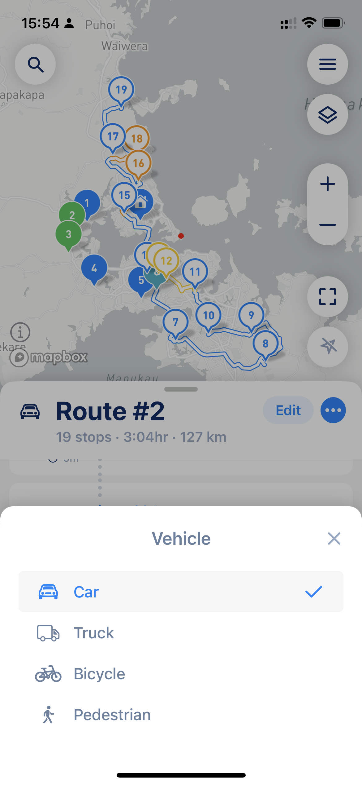

# Why do some of my stops have issues, "Path not Found" or "Unexpected error"

## **Stops with Issues**

MyWay Route Planner has an intelligent system that recognizes issues related to stops and can mark some of the stops like stops with issues. There are many reasons why a stop can be marked as a stop with issues. The most common are: stop can\t be reached by public road (it can happen because [vehicle type](why-do-some-of-my-stops-have-issues-path-not-found-or-unexpected-error.md#vehicle-type-issue), or simply no road access), no ability to satisfy [time windows](../guides/understanding-stop-settings.md#time-windows) for a stop (because of tight schedule, or many stops with time windows), because the stop is in a different country, on the island, in the forest. All those issues will be shown by MyWay on the [optimization screen](../guides/how-to-use-myway-route-planner.md#optimization-mode) so you can make a decision on what to do with them. 

## **You reached stops limit**

MyWay Route Planner supports up to 200 stops (including done, scheduled, and missed) + start and finish locations. Please make sure you are not out of the limit and that the overall number of all stops is 200 or less.

## **Path not Found**

A **"Path not Found"** message usually tells you there is a problem with one or more stops on your route and that stop/stops can’t be accessed by the public road (they are on an island, in a forest, really far from other stops, etc.). This case is pretty difficult to resolve with optimization algorithms automatically, so that will require some manual check of those stops by a user. To help you resolve this, the app will mark stop/stops with known errors and can even exclude them from the optimized stops sequence. In 80% of cases, the "Path not Found" message is a result of [vehicle-type issues](why-do-some-of-my-stops-have-issues-path-not-found-or-unexpected-error.md#vehicle-type-issue) and in 20% it's when you [plan your route outside your location area](why-do-some-of-my-stops-have-issues-path-not-found-or-unexpected-error.md#route-exceeds-90000-km-mi).


P.S. There are some cases when the app can't show an error on a stop because there is no clear reason why. In this case, the app will rely on a user to check all stops manually and figure out those which do not look correct.


## **Route exceeds 90000 km/mi.** 

There are some cases when you might get a message that the route length exceeds 90000 km. Usually, it happens when you build a route not in your region, on another continent, across long distances, etc. Examples:

* You are planning a trip to Europe, and all your stops are located there, but you set a start location in the USA
* You have stops spread across all states in the USA, one stop in one state
* You have set stops in some local area, but set finish location is some island that does not have road connection to local area stops are set
* You are planning a trip to Europe and set a start location in Europe and stops are set there as well, but then you want to reoptimize the route and the route now returns the error message.

**Solution:**\
\
**If you build a route in a remote region please** [**disable "current location"**](../guides/how-to-use-myway-route-planner.md#your-location) **and set the specific address as your start and finish (not current location)**. If you reoptimize the route and get this message please also disable the "current location" checkbox in the layers menu. If you have a spread stops list please consider dividing one big route into multiple (like one route for North, South, West, East, or one route for each state or region). Please don't hesitate to contact us if you need help with this.

**Explanation:**

When you build routes, the app builds a destination matrix for each and every stop and how it's connected to each and every other stop. That matrix allows us to understand actual distances between stops and find the most efficient route. In the cases described above the matrix size might exceed 90000 km/mi distance (or like in the first case can't be built at all). That is the reason you receive this error message. Other apps ignore this problem and simply build a direct route matrix ignoring actual road connections and layouts. That over-the-air connection completely messes with route optimization but does allow those apps to look great on paper when you build your route.

## **Vehicle type issue.** 

It can happen if your vehicle type is a big vehicle, like a truck (lorry). The error will appear when the optimization algorithm and/or navigational services do not see any ability to build a route for this type of vehicle to one or more stop/stops (low bridges, narrow roads not suitable for a long or tall vehicle, etc.). This case is easy to resolve by changing a vehicle type to a car. Do not worry, the majority of vehicles will do just fine on routes for a car or van. It is just those trucks that are long, tall, or big that are going to face issues and absolutely must use a small truck or truck as a vehicle type.

<figure><figcaption>
Vehicle type settings
</figcaption></figure>


[Vehicle Type](../guides/understand-vehicle-settings.md) and [Route Settings](../guides/understand-optimisation-settings.md) can affect the route look, its time and distance, as well as overall route "correctness" and convenience. [Please make sure you use the right settings](the-route-myway-produced-doesnt-look-correct.md) to get the best results for your needs.


## **Unexpected Error**

An **"Unexpected Error"** message usually tells there is a problem with the optimization algorithm. Please check your route and try again in a minute or so. If the issue still exists, please [share your route with ](../guides/export-your-route-and-share-it-with-others.md)us so we can assist you in [resolving the issue](../how-to-contact-us.md).
