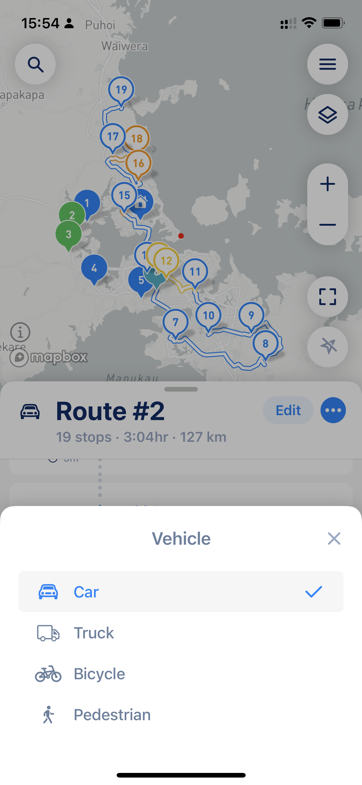

# Why some of my points are marked as incorrect or "Path not Found" or "Unexpected error"?

## **You reached stop limit**

MyWay Route Planner supports up to 200 stops (including done, scheduled, and missed) + start and finish locations. Please make sure you are not out of the limit and that the overall number of all stops is 200 or less.

## **Path not Found**

A **"Path not Found"** message usually tells you there is a problem with one or more stops on your route and that stop/stops can’t be accessed by the public road (they are on an island, in a forest, really far from other stops, etc.). This case is pretty difficult to resolve with optimization algorithms automatically, so that will require some manual check of those stops by a user. To help you resolve this, the app will mark stop/stops with known errors and can even exclude them from the optimized stops sequence. Also, the "Path not Found" message might be a result of vehicle-type issues. Please check them below.


P.S. There are some cases when the app can't show an error on a stop because there is no clear reason why. In this case, the app will rely on a user to check all stops manually and figure out those which do not look correct.


## **Vehicle type issue.**&#x20;

It can happen if your vehicle type is a big vehicle, like a truck (lorry). The error will appear when the optimization algorithm and/or navigational services do not see any ability to build a route for this type of vehicle to one or more stop/stops (low bridges, narrow roads not suitable for a long or tall vehicle, etc.). This case is easy to resolve by changing a vehicle type to a car. Do not worry, the majority of vehicles will do just fine on routes for a car or van. It is just those trucks that are long, tall, or big that are going to face issues and absolutely must use a small truck or truck as a vehicle type.

<figure><figcaption>
Vehicle type settings
</figcaption></figure>


[Vehicle Type](../guides/understand-vehicle-settings.md) and [Route Settings](../guides/understand-optimisation-settings.md) can affect the route look, its time and distance, as well as overall route "correctness" and convinience. [Please make sure you use the right settings](the-route-myway-produced-doesnt-look-correct.md) to get the best results for your needs.


## **Unexpected Error**

An **"Unexpected Error"** message usually tells there is a problem with the optimization algorithm. Please check your route and try again in a minute or so. If the issue still exists, please [share your route with ](../guides/export-your-route-and-share-it-with-others.md)us so we can assist you in [resolving the issue](../how-to-contact-us.md).
