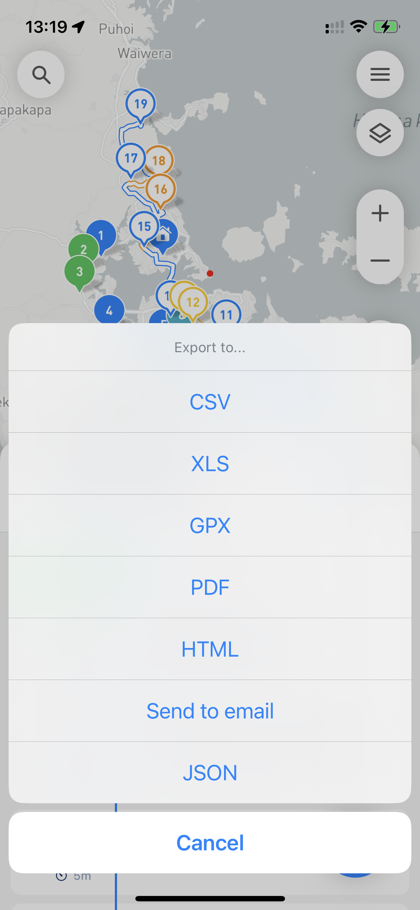

# Export your route and share it with others

You can export your route from MyWay Route Planner at any moment. To be able to do so, you need to click on the 3 dots button next to the route name, and there you have two options:

* [Basic Export](export-your-route-and-share-it-with-others.md#basic-export)
* [Share Route Copy](export-your-route-and-share-it-with-others.md#share-route-copy)

<figure><figcaption>
Export and Share route copy
</figcaption></figure>

## Basic Export

If you need to export a file like .CSV, .XLS, .PDF, .HTML, etc. you need to pick the "Export" option. That option is useful if you simply need to pass information about your route to someone or save it for later. If you are planning to import that list later, we recommend saving it either into either .CSV or .XLS. If you need some sort of route report .PDF will work better for that matter.

<figure><figcaption>
Export file options
</figcaption></figure>

## Share Route Copy

If you want to share your route with someone else (like your driver, colleagues, etc.) we recommend the "Share Route Copy" option. That option will create a route link that you can pass to anyone by messenger, email, etc. When that person opens that link on their mobile device if MyWay is installed it will suggest importing that route straight away, and if the app is not installed the link will redirect the user to the page they can download MyWay from.

<figure><figcaption>
Share Route Copy Setting
</figcaption></figure>

 

<figure><figcaption>
Route Import Screen
</figcaption></figure>

When you share the route by link, the link is going to be available for 30 days only. After that we will delete that route data from our server so please make sure the drive is received and processed by the person you share it with.


Please keep in mind that by sharing routes with others you might unintentionally share some sensitive data.&#x20;

When you use the "Export" > .CSV, .XLS method, or "Share Route Copy" method, we do not share any stop statuses (like proof of delivery, signatures, etc.). The only way to export a report with this data is the "Export" > .PDF option (as it server the purpose of "Visit/Delivery Report". Also, we don't store any information on our servers. If you want to learn more about where we store data, please check[ this article](../faq/your-privacy-and-where-we-store-your-data.md).

