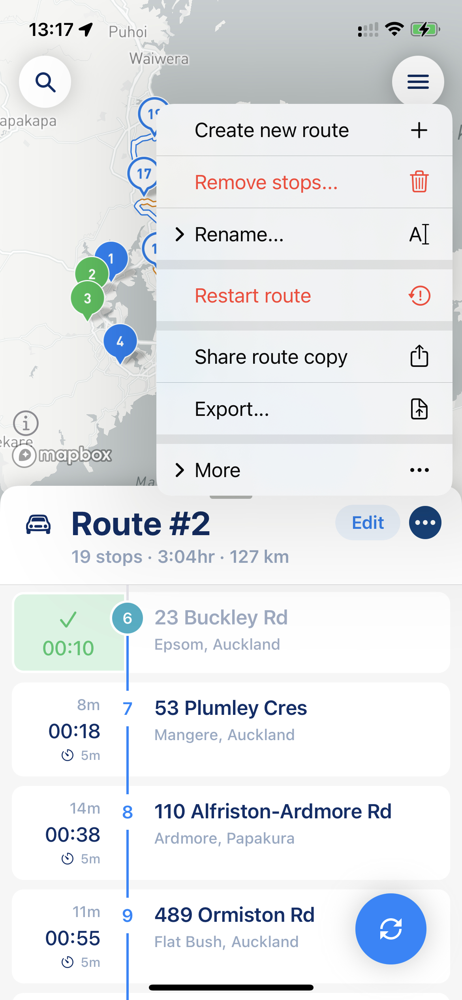
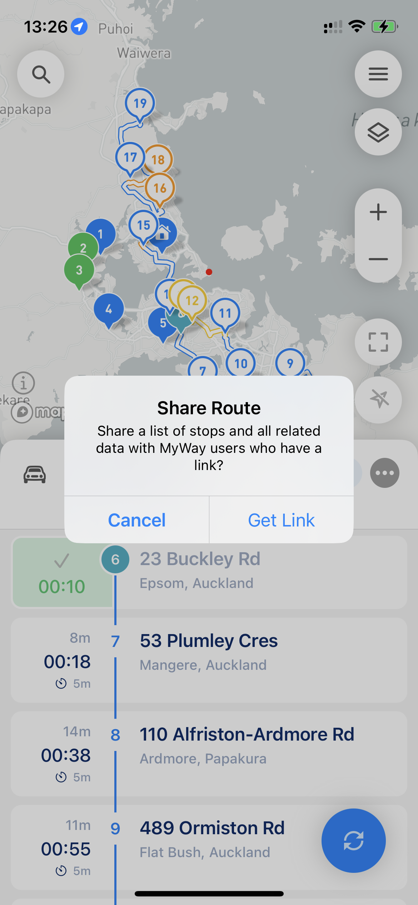

# Export your route and share it with others

You can export your route from MyWay Route Planner at any moment. To be able to do so, you need to click on the 3 dots button next to the route name, and there you have two options:

* [Basic Export](export-your-route-and-share-it-with-others.md#basic-export)
* [Share Route Copy](export-your-route-and-share-it-with-others.md#share-route-copy)

<figure><figcaption>
Export and Share route copy
</figcaption></figure>

## Basic Export

If you need to export your route to a file like .CSV, .XLS, .PDF, etc. you need to pick the "Export" or "Export Route" option. That option is useful if you simply need to pass information about your route to someone or save it for later. If you are planning to import that list later, we recommend saving it either into either .CSV or .XLS. If you need some sort of route report .PDF will work better for that matter.

<figure><figcaption>
Export file options
</figcaption></figure>

## Manifest (Web Link)

You can export your route to Manifest (Web Link). This option is available when you pick the "Export" or "Export Route" option from the menu. Manifest will allow those who don't have the app yet to see your route and access it from Web or Phone. Also, Manifest can be a "print-friendly" option for you if you need to print your route on paper.

<figure><figcaption>
Route Manifest
</figcaption></figure>

## Share Route Copy

If you want to share your route with someone else (like your driver, colleagues, etc.) we recommend the "Share Route Copy" option. That option will create a route link that you can pass to anyone via messenger, email, SMS, etc. When a person opens that link on their mobile device, if MyWay is installed, it will suggest importing that route to the MyWay App straight away, and if the app is not installed the link will redirect the user to the web page they can download MyWay from.

<figure><figcaption>
Share Route Copy Setting
</figcaption></figure>

 

<figure><figcaption>
Route Import Screen
</figcaption></figure>

When you share the route by link, the route link will be active for 30 days only. After that, we will delete that route data from our server, so please make sure the drive is received and processed by the person you share it with. We delete routes as per our privacy policy and to make sure all data belongs to you and no one else.


Please keep in mind that by sharing routes with others, you might unintentionally share some sensitive data.&#x20;

Please make sure that the file you share does not have sensitive data, and clear the data if necessary. Different export options provide different data exports. You can always find the format you need, or simply clean some fileds you don't need (like example from .XLS format).

