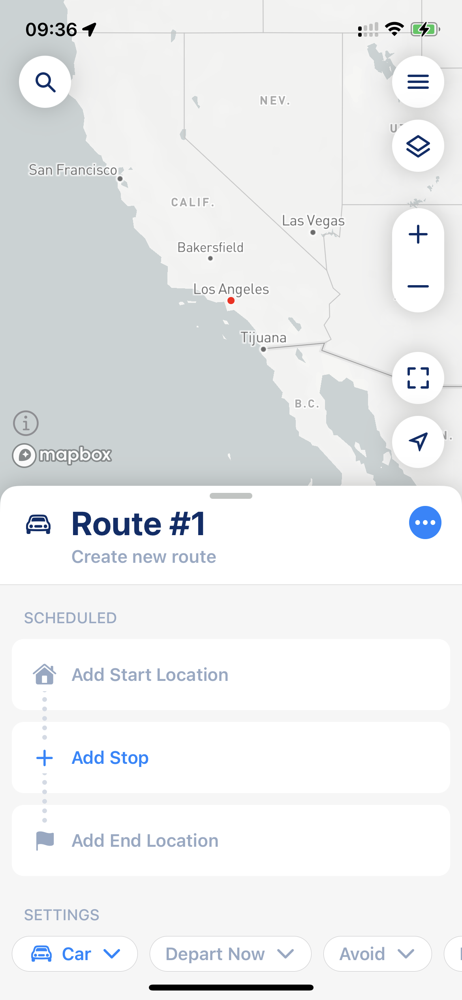
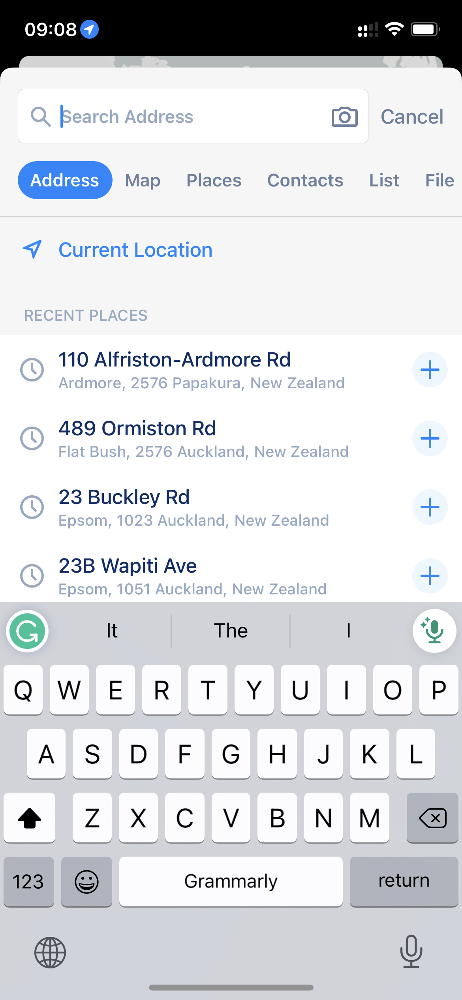
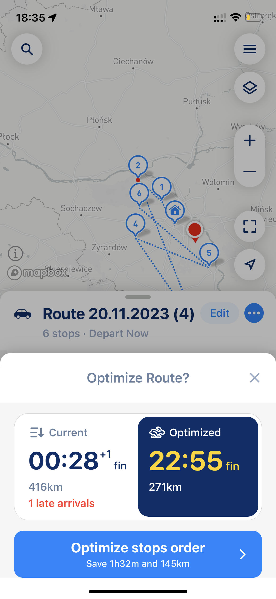
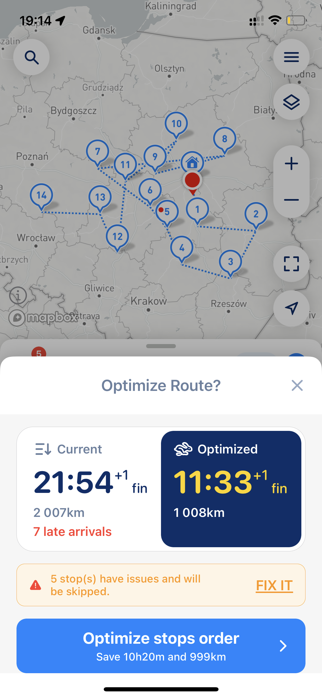
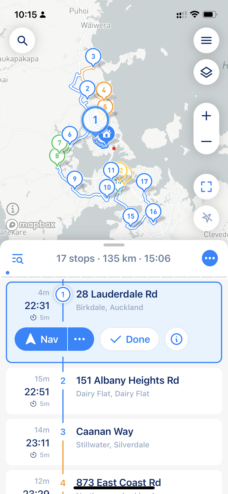
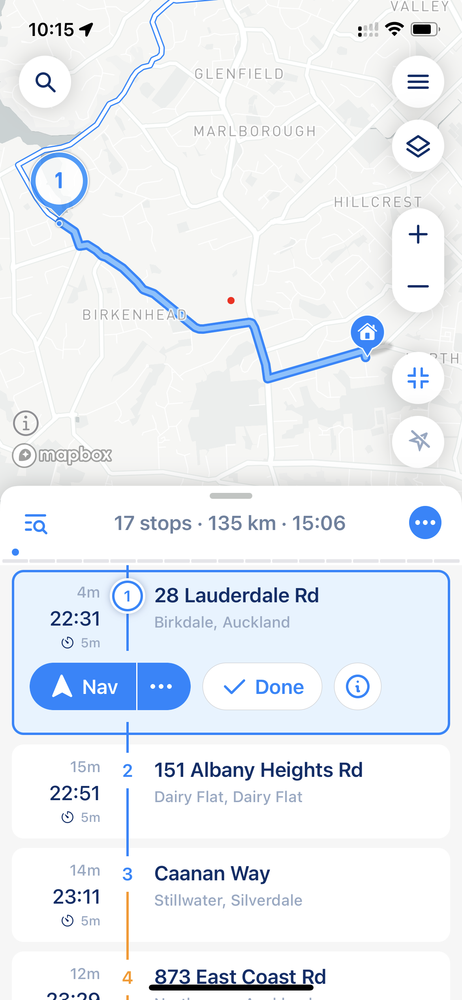
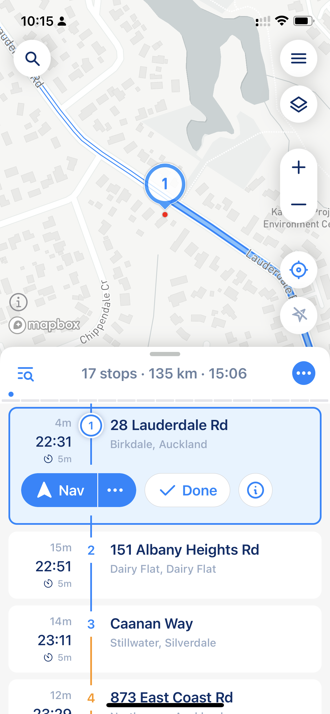

# How to use MyWay Route Planner

The primary purpose of the MyWay Route Planner is to save you time and money by reducing the need for manual route planning and minimizing mileage traveled. MyWay Route Planner will help you cut down on route planning time and efficiently plan routes with multiple locations in seconds.&#x20;

After downloading the app from [Apple AppStore](https://apps.apple.com/us/app/delivery-route-planner-myway/id1557014712) or [Google Play Market,](https://play.google.com/store/apps/details?id=com.proalab.mywayapp) you need to open it, and the first thing you see is the app's main screen.

## Build and Edit Routes

### Add Stops

<figure><figcaption>
Main Screen (Route Edit Mode)
</figcaption></figure>

Add a Start Location (required), an End Location (optional), and any number of stops. To add a stop, click "Add Stop" or use the magnifier button in the top left (check the screenshot above). You also can [save Start and Finish](understanding-stop-settings.md#start-and-finish-settings) locations as a default for future routes.

With MyWay, you can add an address using various sources, including a **basic address search, map selection,** [**saved places**](managing-your-contacts-and-places.md#places)**,** [**contacts**](managing-your-contacts-and-places.md#contacts)**,** [**lists**](import-from-file-and-multi-line-import.md#multiline-import)**,** [**file uploads**](import-from-file-and-multi-line-import.md#import-from-file)**,** [**external links**](export-your-route-and-share-it-with-others.md#share-route-copy)**, photos, or dictation through audio input**. Refer to the screenshot below to see what the “Add Stop” process looks like.

<figure><figcaption>
Add Stop options
</figcaption></figure>



**IOS**

**Photo Input -** If you don't see a photo icon in search input, it means your iPhone or iOS does not support photo input - [https://support.apple.com/en-au/guide/iphone/aside/iph691752bc0/17.0/ios/17.0](https://support.apple.com/en-au/guide/iphone/aside/iph691752bc0/17.0/ios/17.0) or does not support your language - [https://www.apple.com/ios/feature-availability/#live-text-live-text](https://www.apple.com/ios/feature-availability/#live-text-live-text)

\
**Voice Input -** If you don't see dictation input (microphone icon), you might want to turn on dictation in iOS settings - [https://support.apple.com/en-au/guide/iphone/iph2c0651d2/ios](https://support.apple.com/en-au/guide/iphone/iph2c0651d2/ios)



**Android:**

**Photo Input -** If you don’t see the photo icon next to the search input, it means that the photo input feature is not available on your device (or phone language is not supported).

**Voice Input -** If you don't see dictation input (microphone icon), please follow this instruction to turn it on - [https://support.google.com/gboard/answer/2781851?hl=en\&co=GENIE.Platform%3DAndroid](https://support.google.com/gboard/answer/2781851?hl=en\&co=GENIE.Platform%3DAndroid) also some manufacturers have a different way to turn it on, please refer to your phone manual.



Use the "+" button to add multiple stops. To view a stop on the map, click the address in the list on the left (click on the left side from the + button).


Some addresses might not appear in the search results. If this happens, try adding more details to the search field. If the issue persists, switch to a different geocoding provider. MyWay is the first and only app that supports multiple address geocoding providers, and [you can change it in the app settings](../i-cant-find-an-address.md#changing-data-provider-address-geocoding-service).


## Route Parameters (Route Settings)

At the bottom of the Main Screen, you can find route settings like [Vehicle Type](understand-vehicle-settings.md), Departure Time, [Avoid options](how-to-use-myway-route-planner.md#avoid-options), Road Side (for all stops in the route, can be: any side of the road, your driving direction side, or opposite road side), and [Optimization Mode (Time/Distance)](how-to-use-myway-route-planner.md#optimization-mode). These settings are available only when you plan your route, not after you start it.&#x20;

**Route parameters are very important and can dramatically change your route time, distance and it looks**. Take some time to experiment with them, because there is no one-fits-all solution. At the end, you will get a route that looks exactly how you want it set up for your specific needs.

<figure><figcaption>
Route Parameters
</figcaption></figure>


You can plan your route and view ETAs in advance by setting "departure time". However, avoid clicking the “Start Now” button unless you’re ready to begin, as it will recalculate all ETAs based on the current time. This ensures your ETAs are accurate when you actually start your route. When you’re ready to go, simply click “Start Now” and mark your Start Location.


### Optimization Mode

**One of the most impactful settings for route planning is Optimization Mode**, which offers two options: By Time and By Distance. This global setting affects both the optimized routes generated by the app and the order of your stops.

**Optimization by Time is recommended in 90% of cases.** It works similarly to most navigation apps, focusing on efficiency rather than the shortest path. While the route might be slightly longer in distance, it’s typically faster, more fuel-efficient, and more convenient. These routes usually involve fewer turns, traffic lights, and route changes.

Optimization by Distance prioritizes the shortest possible route, even if it sacrifices time and convenience. Routes optimized this way often include more turns, traffic lights, and route changes. While it’s less practical for most users, it can be useful for drivers who are highly familiar with the area.

### Avoid Options

Avoiding allows you to exclude specific elements from your route, such as highways, ferries, or toll roads. However, some of these elements might be necessary to complete the route, so exclusions aren’t always guaranteed. If avoiding certain elements isn’t possible, the app will still prioritize minimizing their use whenever it can.


Keep in mind that you need to set the same avoid settings in your navigation app as you do in MyWay. Some navigation apps don’t accept these settings from external apps, meaning they will ignore the avoid preferences when the route is passed over.


## Stop's Settings

Yeach stop has[ stop parameters like time windows, priority, notes, color, etc](understanding-stop-settings.md). To change stop settings, click on the stop added to the route.


Please remember that the "Optimization by Distance" can ignore stop settings like priority and time windows. The only option that supports time windows and priority setting in full is "Optimization by Time."



_When you add stops, please pay attention to the warnings and errors MyWay is showing you. For example, if the app believes the stop is incorrect or placed in the wrong place (like another country), it will show you an orange exclamation mark next to the stop. If you get any errors, please check_ [_our article that explains what they mean and how to get them sorted_](../faq/why-do-some-of-my-stops-have-issues-path-not-found-or-unexpected-error.md)_._


MyWay Route Planner also supports multi-day routes. If you want to know how to build them, please [check this article](planning-multi-day-routes.md).

After you add all stops and select the route parameters, click the blue button with arrows at the bottom right. After you do that, the route will be sent to the route builder, and you will be presented with Route and Optimization Options.

## Optimization Options (Build and Optimize your route)

• [**Current keeps the stop order**](understand-optimisation-settings.md#optimize-reoptimize-route-settings) exactly as you entered it, with no optimization applied.

• [**Optimized**](understand-optimisation-settings.md#optimize-reoptimize-route-settings) **automatically reorders the stops for the fastest or shortest route**, based on your selected optimization mode.


Sometimes, an optimized route traveling time or distance can be more significant or take more time than the route without optimization. It happens because optimization considers all stop parameters. [Parameters like "time windows," "priority," and "service time" will affect your route's overall time and distance](understanding-stop-settings.md). Our **algorithm built the most efficient route possible, considering all these parameters**. It just may look like it is less efficient than the current order, as the **current order simply ignores all parameters**. If you want more about this, please check our [article that explains how the route optimization algorithm works](../faq/the-route-myway-produced-doesnt-look-correct.md).



MyWay will show you late arrivals and [issues](../faq/why-do-some-of-my-stops-have-issues-path-not-found-or-unexpected-error.md#stops-with-issues) so you can make informed decisions about what to do with them. In some cases, like tight time windows or messed stop priorities, there is a possibility that the algorithm can't find the best order that satisfies all parameters. Sometimes, the app can't even build your (Current) order as there are many issues with stops. In this case, the app will show you a warning and will suggest you modify some of those stops (or simply skip them). It will show you late arrivals and issues so you can make informed decisions about what to do with your stops.


<figure><figcaption>
Late Arrival
</figcaption></figure> <figure><figcaption>
Optimization Warning
</figcaption></figure>


Our users also told us that some apps "build your route anyway" and show you those missed stops after the fact. It creates a feeling that everything is okay until it's not. We show you this so you can decide what to do before it's too late.


### Confirm your Route

After selecting the route type (Current or Optimized), the app will prompt you to click the “Start Route” button (in some versions can be "Let's Go", etc.). If you’re done planning, click it to proceed. Otherwise, you can continue adding stops, adjusting stop parameters, or building additional routes for reference.

Once you press “Start Route”, the app will recalculate the route using the latest data, including time windows, traffic, and other factors. You can also close the “Start Route” prompt and keep editing your route. When you’re finished making changes, click the blue button with arrows at the bottom right to finalize your route.

<figure><figcaption>
Start Route button
</figcaption></figure>


If you’re planning a route for the future, press the “Start Route” button right when you leave. This ensures the route starts at the correct time, providing accurate ETAs and up-to-date traffic data.



If you want to modify the route after the app builds the stop order, you can still [change the route order—even after it’s built](how-to-use-myway-route-planner.md#changing-the-route-after-route-buit).


## Follow Route

After you start the route: choose your preferred option (Current or Optimized) and click the "Start Route" button - the app will move you to "Follow Route Mode." In this mode you can Navigate to stops (Navigate or Go button), mark stops as visited (Done/Arrived/Success/Failure button), and do many other things.

<figure><figcaption>
Route - Main View
</figcaption></figure> <figure><figcaption>
Route - List View
</figcaption></figure> <figure><figcaption>
Route - Map View
</figcaption></figure>

If you need to change a [Navigation style](understand-navigation-settings.md) (navigate by address/coordinates), click on the 3-dots button next to the "Nav" button ("Go" button). The app will show you a modal window to change navigation mode and the final destination navigation app (Google Maps, Apple Maps, Waze, etc.)

The "Done" button lets you close a stop and activate the next one. In case of "proof of delivery turned on" in App Settings, it will open your Proof Of Delivery Screen. You can read more about [Proof of Delivery](proof-of-delivery.md) here.

Click on a stop to see additional parameters and to add some notes, skip stops, etc.

### Fitting Modes

The fitting mode automatically adjusts the map view to highlight the most relevant part of your route. It dynamically shifts focus based on your journey—whether showing the entire route, your next segment, or just the destination. This feature helps keep your navigation clear and relevant, reducing the need for manual zooming or panning.

MyWay offers three route display modes:

1. Fit the Whole Route – Shows the entire route on the screen.
2. Fit Route from Point A to B – Focuses on the current segment of your journey.
3. Show Destination – Zooms in on the final destination.

**How to Use:**

Tap the button located above the Current Location button (above the "current location button" and just below the map’s zoom controls) to switch between modes.

**When Planning a Route:** Only Fit the Whole Route is available.

**When Following a Route:** The button will cycle through the three modes from left to right automatically (refer to the images below for visual guidance).

<figure><figcaption>
Fit the whole route mode
</figcaption></figure> <figure><figcaption>
Fit current route from point A to B mode
</figcaption></figure> <figure><figcaption>
Show destination mode
</figcaption></figure>

In addition to fitting mods, when you start a route (driving or following it), tap the current location icon to make the map follow your position. The location icon appears filled when this mode is active. In this mode, your location stays centered on the map, and if you move the map, it will automatically adjust to keep your position in view. This is especially useful when using the app for navigation.

### Your Location

You can hide your current location to make it easy to work with the route. It's handy when you build and manage routes outside of your area. To hide your location, go to layers (top right button below the main menu) and uncheck the "My Location" checkbox. When you have "My location" on, "Fit the whole route" mode will include your location and all route stops. When "My Location" is off, only your stops in the fitting mode will be included.&#x20;

<figure><figcaption>
My location checkbox in the Layers Screen
</figcaption></figure>

When you follow your route and want' to ["Update"](how-to-use-myway-route-planner.md#update-and-actualize-route) it to actualize ETAs, if access to your location is ON, MyWay will take your location as an "intermediate starting" point. That will greatly improve ETA calculation and will build you a much more accurate route. However, this can cause issues when your location is in a different country or can't be accessed by public roads. We recommend checking [Optimisation Settings ](understand-optimisation-settings.md#starting-location)to see how location can affect your routes.

### Update and Actualize Route

If you see that you are running late or have changed your route, you can update all ETA's and stop the order. You can do that by pressing the 3 dots menu button (in the route header) and picking the "Update Route" option or do complete Reoptimization. [Read more about those options](understand-optimisation-settings.md#route-update-and-reoptimize).

## Making route changes after the initial route is built

MyWay lets you make changes even after optimization—before you start the route or while it’s already in progress. Whether it’s a small tweak or a full overhaul, you’re always in control. There are three ways to edit a built or active route:

**Modify Route Before Starting**

If you’ve already optimized and selected an order (either Current or Optimized), but want to make adjustments before starting, tap the arrow button next to “Start Route.” Make your changes, then tap the blue arrows button and pick Current Order to keep your custom stop sequence.

**Modify Route After Starting**

**Quick Add & Reorder:** Need to drop in one or two extra stops? Tap the search icon (magnifying glass), find the stop, and tap “Add to Route.” MyWay will insert it near the closest existing stop. Long-press to drag and reorder. Tap the blue arrows button and hit “Update” to refresh ETAs.

**Full Edit Mode:** For multiple changes, tap the three dots in the route header and select “Edit Route.” Add stops using the search icon or “Add Stop.” Reorder by dragging. Then tap the blue arrows button and pick:

• “Current Order” to keep your manual layout

• “Optimized” to rebuild and get the most efficient route

Use Quick Add for minor updates. Use Edit Mode for bigger revisions. Use the pre-start modification if you need to make quick changes right before heading out.

## Video Guide


[**MyWay Route Planner - How To - Build Route - Video Instruction (YouTube)**](https://youtube.com/shorts/PnuFrcaUkiE?feature=share)



If at this stage you have any questions, please drop us a line through online chat. In the MyWay app, go to the Main Menu (top right corner, three lines button) > Support section > Talk to Us.

