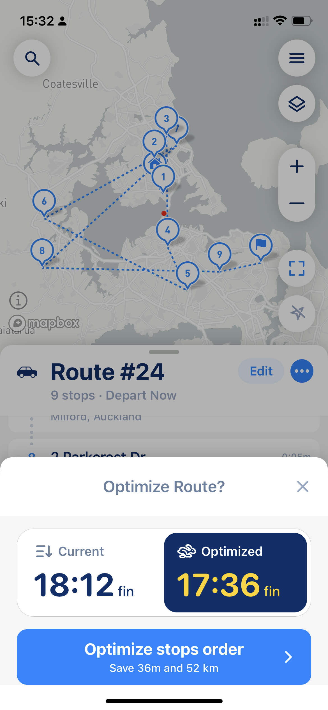

# How to use MyWay Route Planner

MyWay Route Planner is a very straightforward planner that will help you to build your routes in seconds. After downloading the app from [Apple AppStore](https://apps.apple.com/us/app/delivery-route-planner-myway/id1557014712) or Google Play Market, you need to open it, and the first thing you see is the app's main screen.

## Build and Edit Routes

<figure><figcaption>
MyWay Route Planner Main Screen (Route Edit Mode)
</figcaption></figure>

All you need to do is add your first stop (and as many stops as you want) and your Start Location and End Location (optional). To add a stop, you can either click the "Add Stop" button, check the screenshot above, or the magnifier button at the top left corner of the app.

There are multiple sources you can add addresses from, like basic "address search," "map," ["places,"](managing-your-contacts-and-places.md#places) ["contacts,"](managing-your-contacts-and-places.md#contacts) ["list,"](import-from-file-and-multi-line-import.md) ["file,"](import-from-file-and-multi-line-import.md) ["from external link,"](export-your-route-and-share-it-with-others.md#share-route-copy) and "photo." Check the screenshot below to see what the "Add Stop" process looks like.

<figure><figcaption>
Add Stop options
</figcaption></figure>

### Route Parameters (Route Settings)

After you add all necessary stops at the bottom of the Main Screen, you can find route settings like [Vehicle Type](understand-vehicle-settings.md), Departure Time, [Avoid options](how-to-use-myway-route-planner.md#avoid-options), Road Side, and [Optimization Mode (Time/Distance)](how-to-use-myway-route-planner.md#optimization-mode). After you add all your stops and choose suitable parameters, you need to click the big blue button on the bottom right side, and the app will provide you with a few route options (pretty similar to what Nav apps do).&#x20;

All route parameters are very important and can dramatically change your route look, and we recommend taking some time to experiment with them. At the end, you will get a route that exactly looks how you want it set up for your specific needs.

### Optimization Mode

**One of the most important settings that can dramatically change route and its convenience is Optimization Mode.** Optimization Mode has two options: by Time and by Distance. This setting is general and affects optimized routes provided by the app and routes in your order.&#x20;

Optimization by Time is preferable in 90% of cases. Optimization by Time is how most Navigation Apps build your routes, and the route provided can be a little longer from a distance perspective but much more efficient from a fuel economy perspective and driver convenience. Route optimized by time usually has fewer cross-turns, fewer traffic lights, and fewer route changes.

Optimization by Distance is a use case that can shorten your route by sacrificing convenience and time. Route optimized by distance usually has more cross-turns, traffic lights, and route changes. In most of cases, this distance saved does not justify convenience sacrifice but can be helpful for those drivers who know places very well.

### Avoid Options

Avoiding is the simple way to exclude some specific parts of the route, like highways, ferries, etc., from the final route. Note that those route elements like highways are sometimes required to complete a route, so it's not guaranteed that all chosen elements (like highways) will be excluded entirely.

### Stop's Settings

Yeach stop has[ stop parameters like time windows, priority, notes, color, etc](understanding-stop-settings.md). To change stop settings, click on the stop added to the route.


Please remember that the "Optimization for Distance" setting can ignore stop settings like priority and time windows. The only option that supports time windows and priority setting is fully "Optimization for Time."



_When you add stops, please pay attention to the warnings and errors MyWay is showing you. For example, if the app believes the stop is incorrect or placed in the wrong place (like another country), it will show you an orange exclamation mark next to the stop. If you get any errors, please check_ [_our article that explains what they mean and how to get them sorted_](../faq/why-some-of-my-points-are-marked-as-incorrect-or-path-not-found-or-unexpected-error.md)_._


## Optimize Routes

[Optimization options](understand-optimisation-settings.md) like the "Current" card mean the stop order will stay as you added them (the app will not optimize the stop order), and the "Optimized" card means the stop order will be optimized.&#x20;


Sometimes, an optimized route traveling time or distance can be more significant or take more time than the route without optimization. It happens because optimization considers all stop parameters. [Parameters like "time windows," "priority," and "service time" will affect your route's overall time and distance](understanding-stop-settings.md). Don't worry. Our algorithm built the most efficient route possible. It just may look like it is not. If you want more about this, please check our [article that explains how the route optimization algorithm works](../faq/the-route-myway-produced-doesnt-look-correct.md).


At this stage, the app will ask you to click the "Let's go" button, and if you are finished with your route planning, you can do that, or you can continue adding stops and changing stop parameters and having some routes built for you as a reference. After you press "Let's go," the app will recalculate all route time and parameters, taking the newest data into account (like time windows, traffic, etc.)


If you build a route for the future, we recommend pressing the "Let's go" button exactly when you leave for your route so it will start your route exactly when you go for it.&#x20;


## Follow Route

Choose your preferred option and click the "Start Route" button, and the app will move you to "Route Mode," where you can Navigate to stops (Navigate button), close stops (Done button), and do many other things.

<figure><figcaption>
Route - Main View
</figcaption></figure>

 

<figure><figcaption>
Route - List View
</figcaption></figure>

 

<figure><figcaption>
Route - Map View
</figcaption></figure>

If you need to change a [Navigation style](understand-navigation-settings.md) (navigate by address/coordinates), click on the 3 dots button next to "Nav" button. The app will show you a modal window to change navigation mode and the final destination navigation app (Google Maps, Apple Maps, Waze, etc.)

The "Done" button lets you close a stop and activate the next one. In case of "proof of delivery turned on" in App Settings, it will open your Proof Of Delivery Screen. You can read more about [Proof of Delivery](proof-of-delivery.md) here.

"i" icon will allow you to open additional parameters to add some notes, skip stops, etc.

### Location and Fitting Modes

MyWay has three major route representation modes:

* Fit the whole route
* Fit route from point A to B
* Show destination

To activate the desired mode, click the button above the "current location button" (below map scale +- buttons). When you plan a route, only "Fit the whole route" can be turned on, but when you follow the route, the button will switch modes from one to another (check images below; modes are going to be activated from left to right)

<figure><figcaption>
Fit the whole route mode
</figcaption></figure>

 

<figure><figcaption>
Fit current route from point A to B mode
</figcaption></figure>

 

<figure><figcaption>
Show destination mode
</figcaption></figure>

Also, you can hide your current location to make it easy to work with the route. It's handy when you build and manage routes outside of your area. To hide your location, go to layers (top right button below the main menu) and uncheck the "My Location" checkbox. When you have "My location" on, "Fit the whole route" mode will include your location and all route stops. When "My Location" is off, only your stops in the fitting mode will be included. Also, ["My location" affects the optimization setting](understand-optimisation-settings.md#start-from).

<figure><figcaption>
My location checkbox in the Layers Screen
</figcaption></figure>

### Update and Actualize Route

If you see that you are running late or have changed your route, you can update all ETA's and stop order. You can do that by pressing the 3 dots menu button (in the route header) and picking "Update Route" option or do complete Reoptimization. [Read more about those options](understand-optimisation-settings.md#route-update-and-reoptimize).

## Video Guide


[**MyWay Route Planner - How To - Build Route - Video Instruction (YouTube)**](https://youtube.com/shorts/PnuFrcaUkiE?feature=share)



If at this stage you have any questions, please drop us a line through online chat. In the MyWay app, go to the Main Menu (top right corner, three lines button) > Support section > Talk to Us.

