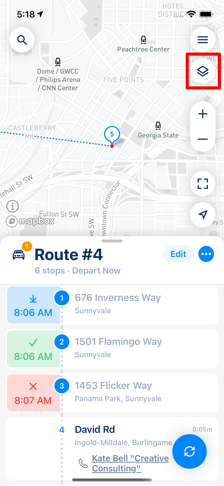
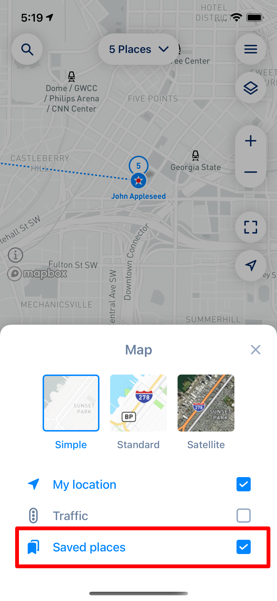
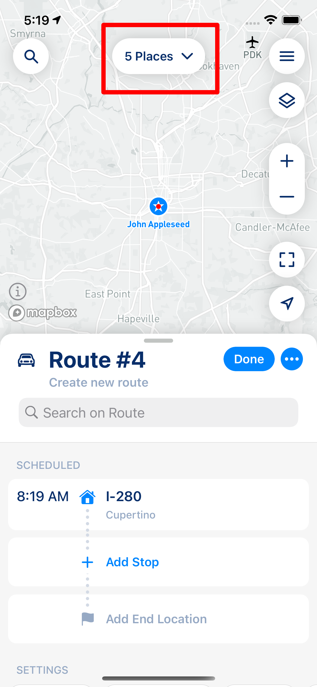

# Managing your Contacts and Places

MyWay Route Planner has a lot of tools that can help you with often-visited places. That is especially valuable for those businesses that go into the same place every now and then and want to have a simple and efficient way to repeat routes or build a new one with a few clicks.

To help you build routes quicker, MyWay has two new concepts: Contacts and Places. Both can be used to add stops to the route.

## Contacts

The contacts section is the new section that you can use when you add stops, and it allows you to add addresses from your phone Address Book. If you decide to provide MyWay access to your Address Book, MyWay will be able to import stops directly into your route and also assign information about specific user data into the stop. To access Contacts, you need to either click on the "Add Stop" button or on the top left magnifier button.

<figure><figcaption></figcaption></figure>

Then, go to the Contacts section and pick a contact you want to add (check the screenshot below).

<figure><figcaption></figcaption></figure>

 

<figure><figcaption></figcaption></figure>

After you pick contact (or multiple), you will be able to see them as a stop.

<figure><figcaption></figcaption></figure>

## Places

Places work in a similar way, but there is much more in them than in Contacts. This feature will be useful for sales, delivery drivers, and everyone who needs to build a list of Favorite Places with specific parameters and contact details, grouped by color, tags, etc.&#x20;

To use this feature, first of all, you need to build your list of Places. To do so, click on the top right menu icon and go to the Places section. You can either create a new Place (click the + icon on the top right) or import it from your Address Book (Import Contacts)

<figure><figcaption>
Main Screen
</figcaption></figure>

 

<figure><figcaption>
Menu
</figcaption></figure>

 

<figure><figcaption>
Places
</figcaption></figure>

After you add a place, you can manage it the same way you manage your stops. Add time window, contact details, tags, notes, etc.

To add a stop from your Places to your Route, you can either add it through the "Add Stop" screen or the top left magnifier button (Places section). Pretty similar to other options like Address or Contacts.

There is one more way to add multiple Places to the route. You need to go to Layers > Saved Places and check it.

<figure><figcaption></figcaption></figure>

 

<figure><figcaption></figcaption></figure>

After you do that, you will see the total amount of places up top, and by clicking on them, you can open the Places Select screen. That screen allows you to select multiple places and add them to the route in a very quick and effective way.&#x20;

<figure><figcaption></figcaption></figure>

 

<figure><figcaption></figcaption></figure>

For example, you can click on the "work" tag > then select and click the "Add missing to Route" button to add all stops that share the "work" tag.&#x20;

<figure><figcaption></figcaption></figure>

You also can add stops individually, from the map, or in any other way you want to.

## Video Guide


[**MyWay Route Planner - How To - Places - Video Instruction (YouTube)**](https://youtu.be/WtixhY3EYTg)

