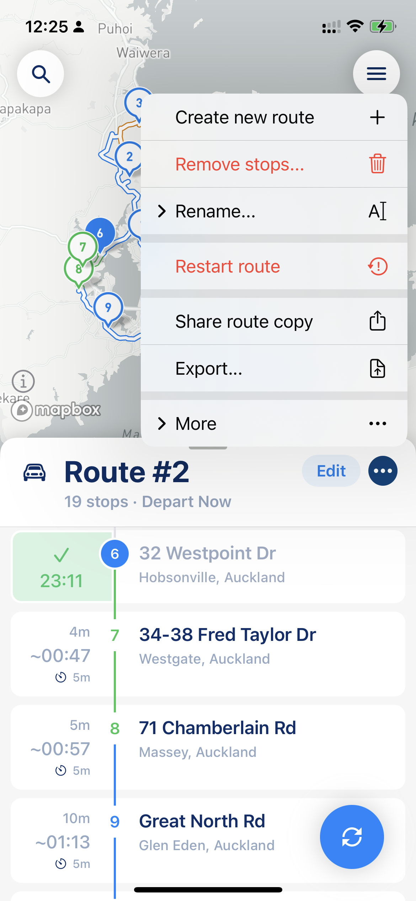
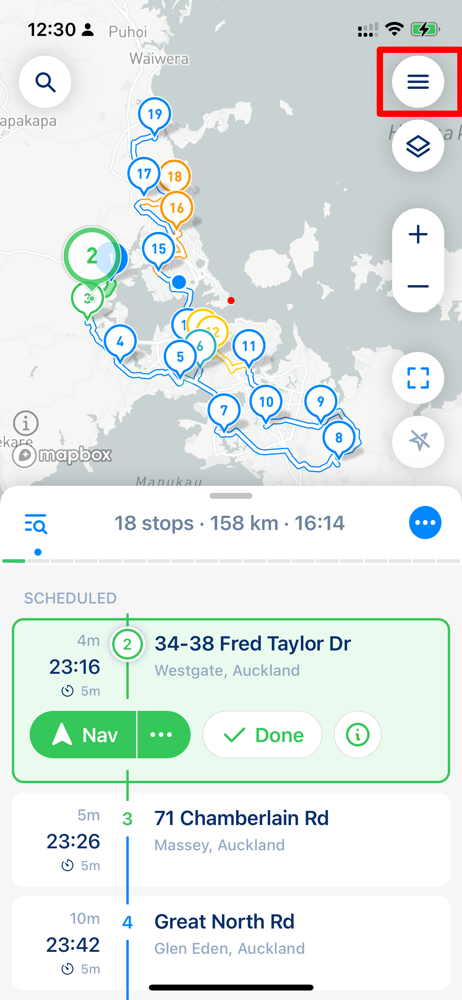
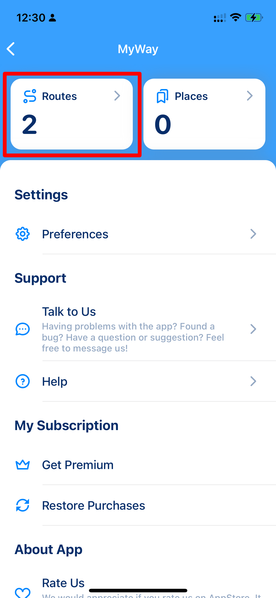
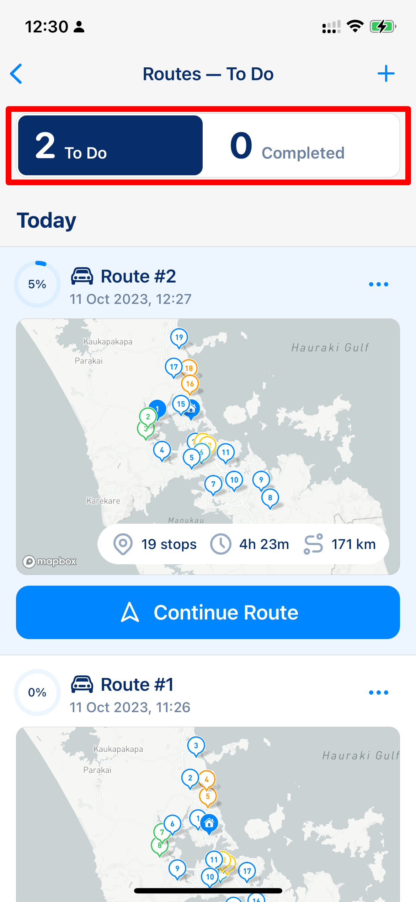
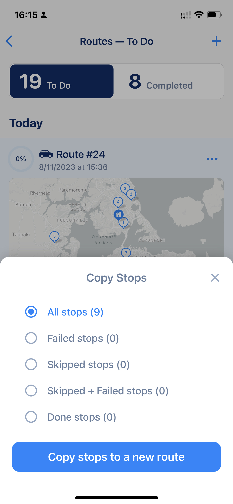

# Managing your Routes

MyWay Route Planner allows you to create as many routes as you want. Creating routes is pretty simple. All routes are automatically saved after you have made any changes.

## How to create a new route?

When you are in route mode, to create a new route, all you need to do is click on three dots button next to a route name (please see screenshots below) and choose the "New Route" option. Your current route is going to be saved automatically in the Routes section.

<figure><figcaption>
Route Menu on Main Screen
</figcaption></figure>


Don't worry, you will not lose your current route or its history. The app automatically saves the current route and all data on your device.


Also, from that menu, you can rename your route, [export](export-your-route-and-share-it-with-others.md) it, and share it with others.

## Where do you find all your routes?

All routes are stored in the Routes section, which can be accessed from the main menu (that one that has an app setting). Please see the screenshots below. All buttons on screenshots are highlighted in red.

<figure><figcaption>
Main Window
</figcaption></figure>

 

<figure><figcaption>
App Settings
</figcaption></figure>

 

<figure><figcaption>
Routes Sections
</figcaption></figure>

Each route in Routes section has its own menu, and what you can do with a route depends on the route status. To be able to access the route menu, you can click on the three dots button next to the route name (above the map and on the right side of the route name). You can Edit saved Routes, Duplicate them, Download route reports, and do many other things.

<figure><figcaption>
Route menu in Routes Section
</figcaption></figure>


Keep in mind that all data except shared routes are going to stay on your device. If you want to know more about when we store your data, please check [this article](../faq/your-privacy-and-where-we-store-your-data.md).


## Duplicate route and Copy Stops

### Route Duplicate

Our app allows you to make a complete duplicate of the previous route for your needs. To do that, you go to Routes section > find the route you want to duplicate > click the 3 dots button next to its name > Duplicate. In this case, the route will be copied with all its parameters (like vehicle type, start location, etc.), and a new route will be created.

### Copy Stops

The Copy Stops menu can be found in the same menu when you complete your route. It allows you to quickly transfer some stops from the previous route to a new one without incorporating previous route parameters into the new route. All stops you decide to copy will be copied to the schedule section with their parameters saved.

<figure><figcaption>
Copy Stops options
</figcaption></figure>
