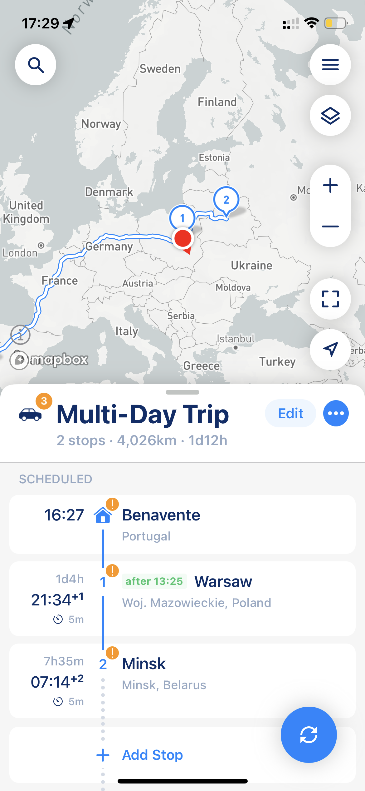

# Planning Multi-Day Routes

MyWay Route Planner, like no other apps on the market, supports multi-day routes, road trips, and travels and has many settings that can help you build, follow, and understand routes better.

<figure><figcaption>
Multi-Day Optimization
</figcaption></figure>

 

<figure><figcaption>
Multi-Day Trip
</figcaption></figure>

However, when you plan a multi-day route, you must be aware of a few things you might need to remember. When you see the +1 index next to the time, that means this time has a place the next day. This is very similar to what you see when you buy plane tickets.

### Time Windows

The next thing is the Time Window. The Time Window setting does not have a concept of the day but simply a period From - To. We have a pretty smart algorithm that predicts if the time window belongs to another day (if you plan a multi-day route), but in a nutshell, you can use the rule of 4 hours to understand the app logic. If you plan the route and set time windows 4 hours later than your start time, then it will almost certainly be pushed to another day.


If your route starting time is 10 am and the time window for some stops is set From 04 am - To 06 am, the app will assume that the time window is set for tomorrow. It will calculate the time difference between the route start time and the latest time, and if the time is greater than 4 hours, it will move the time window to another day.


### Time Zones

MyWay offers two ways to display estimated arrival times (ETAs) for your route.

1. **Local Time Zone**: This option shows ETAs in your local time zone, without considering stop time zones. You can choose this option if you prefer to see ETAs in your own time zone.
2. **Stop Time Zone**: This option takes into account the time zone of each stop on your route. By default, MyWay displays ETAs in the time zone of the stop you're heading to. This is similar to how airlines show arrival times in the destination time zone. If there's a time zone difference between your time zone and the stop's time zone, you may see additional time zone information (like GMT +03:00) next to some times in the app.

**To switch between these options, simply go to the Stop Edit Screen and make your selection.**

<figure><figcaption>
Change TImeZone representation
</figcaption></figure>
