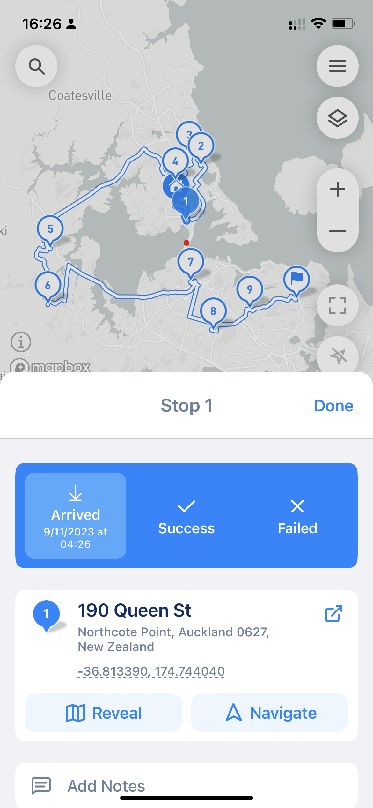
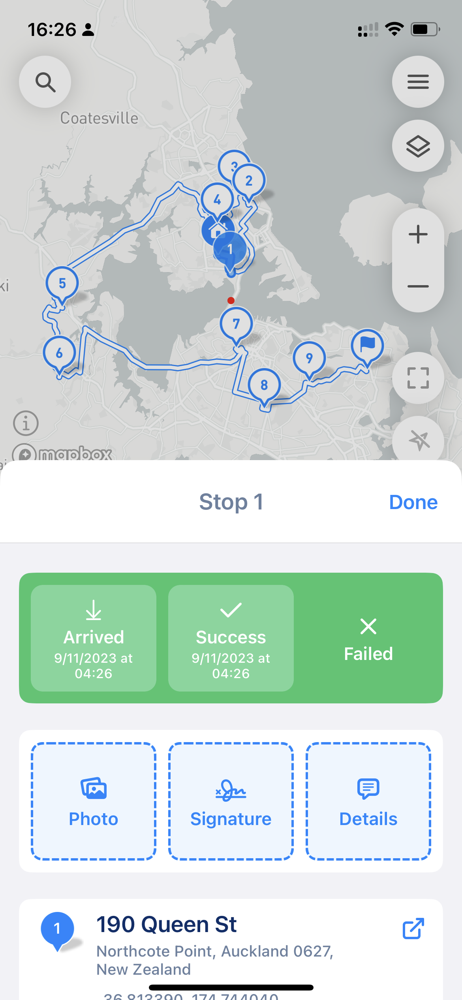
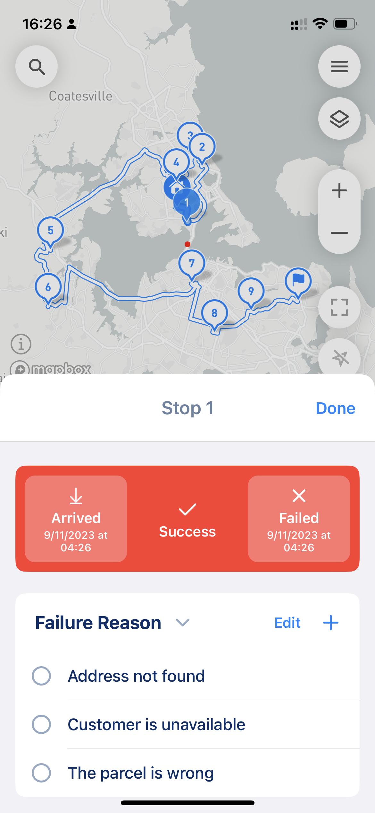
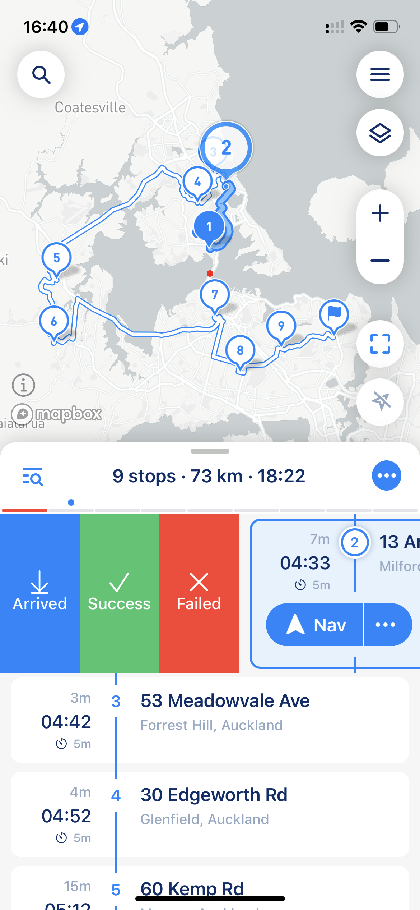

# Proof of Delivery

The app provides several features for managing stops when you on route, such as taking photos, setting statuses, adding notes, collecting signatures, and more. These features depend on the app settings, particularly the “Proof of Delivery” option.

### Behavior of the “Done” Button

The functionality of the “Done” button in route-following mode changes based on the “Proof of Delivery” setting:

• **When “Proof of Delivery” is ON:** The “Done” button opens the Proof of Delivery screen.

• **When “Proof of Delivery” is OFF:** The “Done” button closes the current stop and activates the next one.

### Proof of Delivery Features

Multiple statuses are available, including:

• **Arrived:** Automatically selected when marking “Success” or “Failed” for precise arrival tracking.

• **Success:** Allows adding proof such as photos, signatures, and details.

• **Failed:** Requires selecting a predefined failure reason or adding a custom reason.

Customizing Arrived Status:

If necessary, you can uncheck the “Arrived” status. This prevents the app from marking the stop as visited, which will impact the calculated travel distance.

<figure><figcaption>
only Arrived status in set
</figcaption></figure> <figure><figcaption>
Arrived and Success
</figcaption></figure> <figure><figcaption>
Arrived and Failed
</figcaption></figure>

You can quickly pick the "Proof of Delivery" status from route following mode by swiping stop to the right (see screenshot below) and picking the desired status.

<figure><figcaption>
Proof of Delivery status by swipe
</figcaption></figure>
