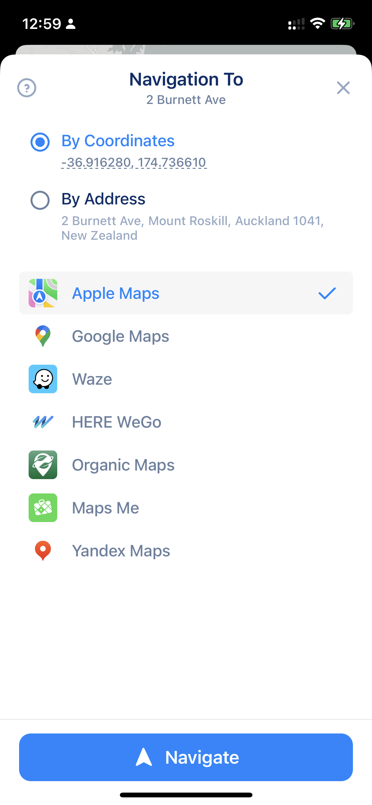
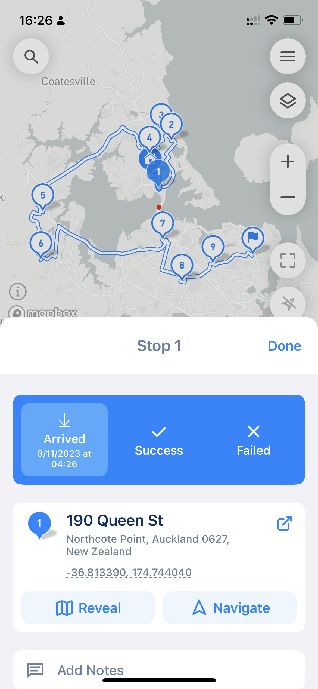

# Understand Navigation Settings

## How to pass the address to Navigation App

MyWay supports many Navigation apps like Apple Maps, Google Maps, Waze, Organic Maps, Here, etc.

To pass a stop to a Navigation app you need to build your route and start it. Then you will see a "Go" (can be "Nav) button with an arrow icon. That button will pass stop details into the nav app so you can navigate to the stop location using your favorite navigation app.

<figure><figcaption>
Nav Button (can be Go, etc.)
</figcaption></figure>


Navigation apps do not support receiving the whole route with a click of a button. Only one stop at a time. It's a navigation app limitation and there is no easy way to address this issue.


## Navigation types: Coordinates or Address

Also, MyWay supports two primary navigation types: Navigation by Address and Navigation by GPS Coordinates. Navigation Settings will determine what data will be transferred from MyWay to the Navigation App of your choice and will affect navigation accuracy in your Navigation App.

You can set Navigation Settings by going to the app Main Menu (top right) > Preference > Navigation App. Also, you can change it by clicking on the 3-dots button next to a "Go" button when you are on route.&#x20;


Navigation by GPS coordinates provides better precision and is more accurate. However, navigation by address might be more accurate if your stop is in a high-density area.


## Navigation Options

You can set Navigation Options by going to the app's Main Menu (top right) > Preference > Navigation Precision. Also, you can change it by clicking the 3-dots button next to a "Go" button when you are on route.&#x20;

<figure><figcaption>
Nav Apps and Nav Options
</figcaption></figure>

### **Navigation by GPS coordinates**&#x20;

Navigation by GPS coordinates provides better precision and is more accurate. In this case, MyWay will pass the stop's GPS coordinates to the navigation app as the destination.

### **Navigation by Address**

Navigation by Address is less accurate because MyWay will pass the stop's address to the Navigation App, and the Navigation App will attempt to find this address in the addresses database. This type might be more accurate if your stop is in a high-density area or your Navigator can't build a route to your stop. If your address does not contain a house number, MyWay will pass coordinates to the Nav App as per a broad number of results, and the Nav App can return.


Some Nav Apps like Waze do not support Navigation by Address and can operate only in Nav by GPS coordinates mode. \
\
Also, some Nav apps find the address based on your location, so if the Nav app finds an address that is very similar to what we passed to but might be closer to your location. In some cases, it might lead to the Nav app sending you to the wrong address. It's infrequent, but we feel like you need to know.


## Reveal Feature

MyWay Route Planner also has a "Reveal" feature onboard. This feature allows you to see your location without starting Navigation. It might be handy when you need to see a picture of your final destination or want to use "Street View." To see the "Reveal" button, you need to start your route > and click the "i" icon next to the "Done" button > Then you will see an address with Navigate, Reveal, and Share buttons (check the screenshot below)


This feature is only available after you have built and launched your route. Click on the stop blank space to see the Stop Parameters screen and the Address block with the Reveal button.


<figure><figcaption>
Address Navigation Options
</figcaption></figure>
