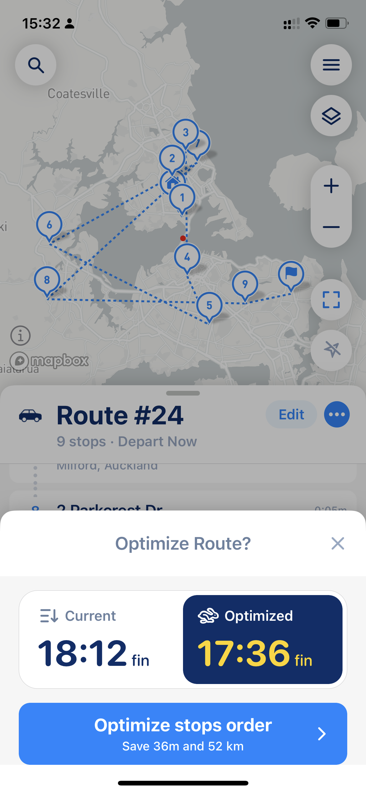
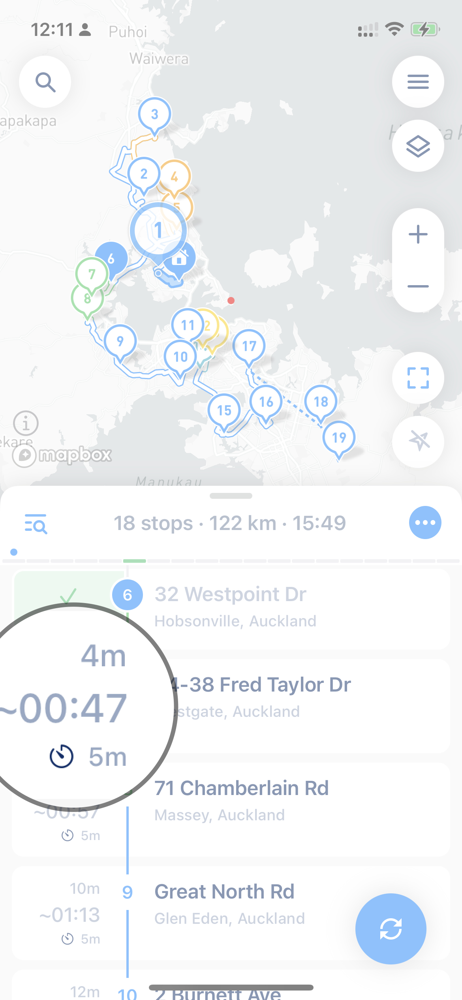
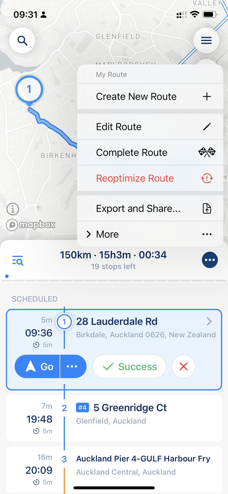
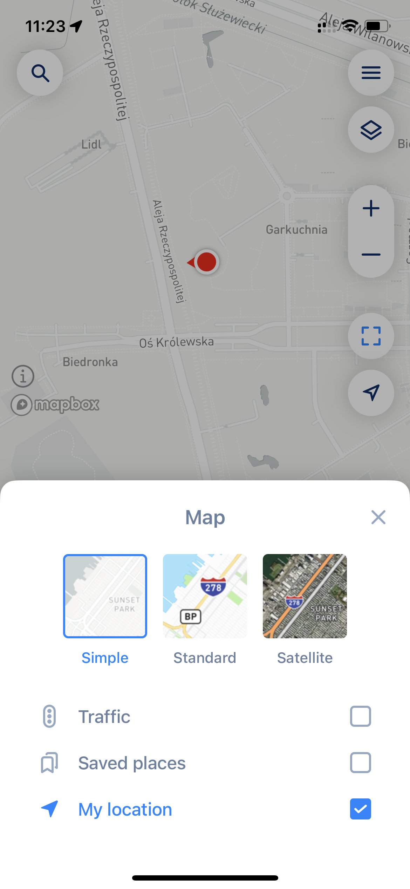

# Understand Optimisation Settings

MyWay Route Planner, like no other app on the market, supports two Route Optimisations (with many parameters). You can build a route the way you want it (without optimization, your own order) and with optimization (when the stops sequence is optimized to provide you with the fastest/shortest route). In addition to these two mods, we explain other suboptions below.

## Optimize/Reoptimize Route settings

**"Current" Mode** will allow you to build a route precisely the way you want it to be. You can build a route and track your route/delivery progress using MyWay functionality.&#x20;

**"Optimised" Mode** will allow you to get the most optimal route from a time and travel distance perspective. This mode is preferable as it **will help you to save time and money on fuel.**

<figure><figcaption>
Optimize Only New Stops Setting
</figcaption></figure>


You also can build a route, optimize it first, go back to edit and modify it to your liking (shuffle stops, add new stops) and then pick ["Update Route"](understand-optimisation-settings.md#route-update-and-reoptimize) to actualize ETA's and order)


## Optimize for Finish Time or Optimize for Overall Travel Time

When you use [Optimization by Time](how-to-use-myway-route-planner.md#optimization-mode) mode, MyWay uses intelligent algorithms to build a route optimal for your needs (settings you pick), but it's not always possible to find the best route without sacrificing specific parameters. That's why your options are important and can greatly influence the final route.  MyWay has two mods that can help you get the optimal route for Finish Time or Travel Time, depending on your departure date. When you need to reduce overall travel time, you can set departure at any time. We recommend setting a specific Departure At when you need to optimize for Finish Time. Even though this setting greatly influences the optimization type, don't worry; your route will be optimal; it simply prioritizes one over another.

## Route Update and Reoptimize

In some cases, your route needs to be Updated or Reoptimized. Some reasons why it might be required or good to do:

* you added some stops after you started your route&#x20;
* you did not close stops in the order suggested by the app
* you want to update the time estimation (ETA's)
* you decided to take a short break, and now the time in your stops does not look correct
* you changed your stop's order and want to actualize your route, etc.

A good sign you might need Route Update is the "\~" symbol next to your time (like in the screenshot below). That symbol represents that time next to it as approximate time only.

<figure><figcaption>
approximate time representation
</figcaption></figure>

Even when we don't show the "Update Route" button (blue button with arrows at the bottom of the right side), you still can recalculate your route by using "Reoptimize Route" option.


In cases when you have some closed stops in the future, and the "\~" symbol is showing, the  route update will not update ETA's for future stops after that future closed stop. In this case, you must go to the menu and do Reoptimization to rebuild your route.


<figure><figcaption>
Update Route and Reoptimize Route items in the Route Menu
</figcaption></figure>

### **Difference beetwen "Route Update" and "Route Reoptimize" options**

This option in the Route Menu is an excellent and straightforward way to update ETAs across all your stops or actualize your stop's order. The **"Route Update" functionality will not change your route order but actualize ETA and will try to insert newly added stops in a position where they make sense.** In this case, the app will keep completed (Done, Arrived, Success, Failed) stops in the Scheduled section. The app will consider them when building the new route so that it might affect the overall route time and distance. **In this case, the route will not be optimal, but the original order will be kept.**

**The "Reoptimize" option will rebuild the whole route based on your preferences and build you an optimal route, considering all changes you have made to your route so far (like newly added stops, finished stops, etc.)** This option will bring you back to [Optimize/Reoptimize Route settings](understand-optimisation-settings.md#optimize-reoptimize-route-settings). In this case, the app will move all completed (Done, Arrived, Success, Failed) stops to the Finished section and exclude them from the route. All distances and closure times will be saved so you will not lose data. **As a result of reoptimization, you will get the most optimal route.**

### Starting location

This setting is not visible in the app but might have two options:&#x20;

* When you have "My Location" turned on (like in the screenshot below) in the application layers screen, your current location and time will be taken as a temporary starting point when you update your route or reoptimize it.
* When you have "My Location" turned off in the application layers screen, the last finished stop (with done status) will be used as the starting point, and the starting time will be that stop completion time.

<figure><figcaption>
My Location settings in App Layers
</figcaption></figure>


The **"My location" option turned off (when the checkbox is not checked) is not recommended**, as it might affect route distance and time estimation accuracy. It also will affect application work and functionality. **It might be helpful if there is no access to your current location or if your current location will break the route** (for example, you are far away from your stops, in another country, on the island, etc.). Still, we don't recommend using it to block app access to your location data on a permanent basis.


## Route Reverse (Reverse Stops Order)

MyWay also supports route reverse when you need to flip the route (for example, you have only the start location and want to start collecting parcels from the farthest stop, coming back to start). This might be useful when your route is narrow and lies in one direction (like a directional sector). You can flip your route by going to the route menu (3 dots blue button) > More > Reverse Stops Order. After that, we recommend picking "Current" as your optimization option to keep your route as you build it.


Please keep in mind that the "Current" option, as well as the "Reverse Route" option, will ignore stop time windows, ASAP flag, and all other stop settings that will be taken into account when you pick the "Optimized" option. The "Current" and "Reverse" options are for users who prefer to follow their routes. You can still optimize route > go to edit mode > change it to your taste > and pick "Current" afterward to make a combo between optimized and current, though.

