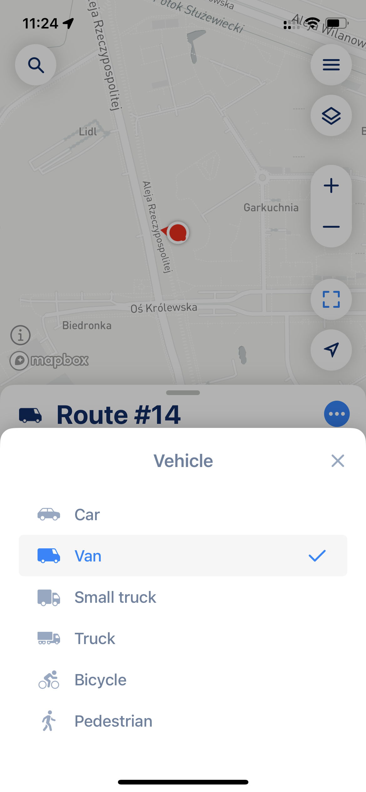

# Understand Vehicle Settings

When using our route planner, selecting the right vehicle type is essential to ensure the optimal planning of your stops. We offer several vehicle options, each designed for specific purposes and with unique parameters. In this article, we'll explore the differences between these vehicle types to help you make an informed choice.


Vehicle options are below your stop list when you plan your route.


<figure><figcaption></figcaption></figure>

For most users, "Car" and "Van" will be the primary options and will satisfy 95% of their needs. We recommend picking options like "Small Truck" and "Truck" only when your vehicle is very high or long and when you want the app to take truck vehicle restrictions into account.


Vehicle Type will affect the route time and distance. Car route will be different from small-truck and from truck overall. There are some weights that applied for each and every vehicle type and those designed to provide more convinience for driver. [Please make sure you use the right settings](../faq/the-route-myway-produced-doesnt-look-correct.md) to get the best results for your needs.

However, if you are a van or truck driver, the optimization algorithm will try to avoid small roads and penalize intersections. The algorithm also knows which areas are not allowed for truck drivers (like tunnels, low bridges, or restricted roads) and will avoid that, so your route will look longer but will be suitable for your specific vehicle type.


## Vehicle Options:

### Car

* **Dimension:** Height = 1.9 meters (6 ft), Width = 1.6 meters (5 ft)
* **Weight:** Up to 3500 kg (7700 lbs)

**Description:** The car is the default vehicle type in our route planner. This vehicle option is suitable for any vehicle type, regardless of v

### Van

* **Dimension:** Height = 2.2 meters (7.2 ft), Width = 2.0 meters (6.6 ft)
* **Weight:** Up to 3500 kg (7700 lbs)

**Description:** The van is suitable for larger vehicles with a slightly reduced speed factor (90%). It has specific height and width dimensions and is designed to carry loads up to 3,500 kg. This vehicle option tends to favor highways and higher-classification roads, such as motorways and trunks, but it also can build your path through living streets if the result is an efficient and convenient route.

### Small Truck

* **Dimension:** Height = 3 meters (9.85 ft), Width = 2.6 meters (8.5 ft), Length = up to 6.7 meters (22 ft)
* **Weight:** Between 3500 kg to 12000 kg (7700-26500 lbs)

**Description:** The small truck is designed for transporting heavier loads with a speed factor of 90%. It has specific height, width, and length dimensions, suitable for loads between 3500 kg and 12000 kg. This vehicle option tends to favor higher-classification roads, such as motorways and trunks, and checks for truck access, width and height restrictions, and weight limits on the roads.

### Truck (Lorry)

* **Dimension:** Height = 4.11 meters (13.5 ft), Width = 2.6 meters (8.5 ft), Length = up to 22 meters (72.2 ft)
* **Weight:** Between 12000 kg to 40000 kg  (26500-88200 lbs)

**Description:** The truck option is like a big vehicle specially designed for carrying cargo over long distances, with a speed factor of 80%. It's suitable for transporting very heavy loads, with specific height, width, and length dimensions, and can handle weights between 12000 kg to 40000 kg. This vehicle option favors higher-classification roads, such as motorways and trunks, and checks for truck access, width and height restrictions, and weight limits on the roads.

### Bicycle

* **Basic Type:** Bicycle

**Description:** The bicycle is an eco-friendly option for small-scale deliveries or personal transportation. It's ideal for urban areas and smaller cargo. By default bicycle vehicle option is tuned toward road bicycles with a slight preference for using cycleways or roads with bicycle lanes. Bicycle routes use regular roads where needed or where no direct bicycle lane options exist, but avoid roads without bicycle access.

### Pedestrian

* **Basic Type:** Pedestrian

**Description:** The pedestrian option is suitable for route planning for walking. The standard walking route excludes roads without pedestrian access. In general, pedestrian routes are the shortest distance with the following exceptions: walkways and footpaths are slightly favored, while steps, stairs, and alleys are slightly avoided.

## Conclusion

Choosing the right vehicle type is crucial for efficient route planning. Consider the type and weight of your cargo, the vehicle's speed capabilities, and its specific dimensions when selecting. This will help you make the most of our route planner for your specific needs. We recommend sticking to the lowest tier when you pick your vehicle type (for example, if you are a courier driver you will be just fine with "Van" vehicle type, if you deliver goods on Long and Tall Ford Transit you might need to pick "Small Truck" option). The lower tier, the less likely route planner will not be able to build a path to your desired destination. If the route planner returns you a "path can be found" error - please [check this article for a solution](../faq/why-some-of-my-points-are-marked-as-incorrect-or-path-not-found-or-unexpected-error.md#path-not-found).
