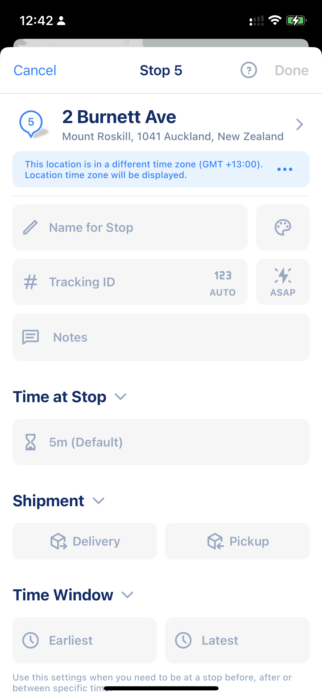
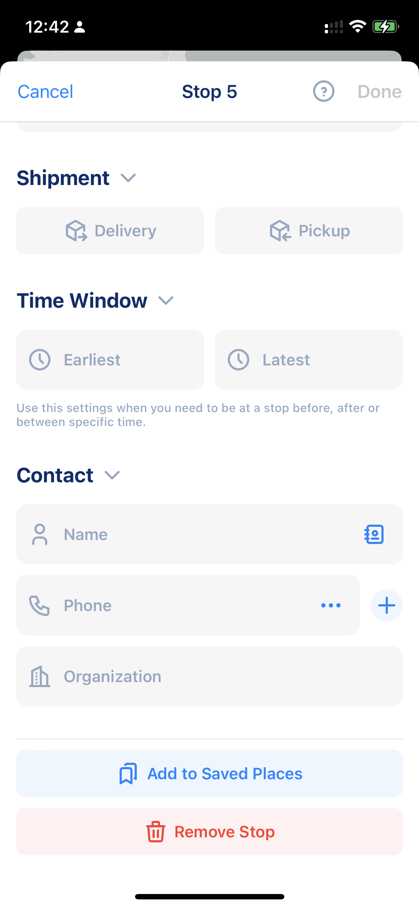
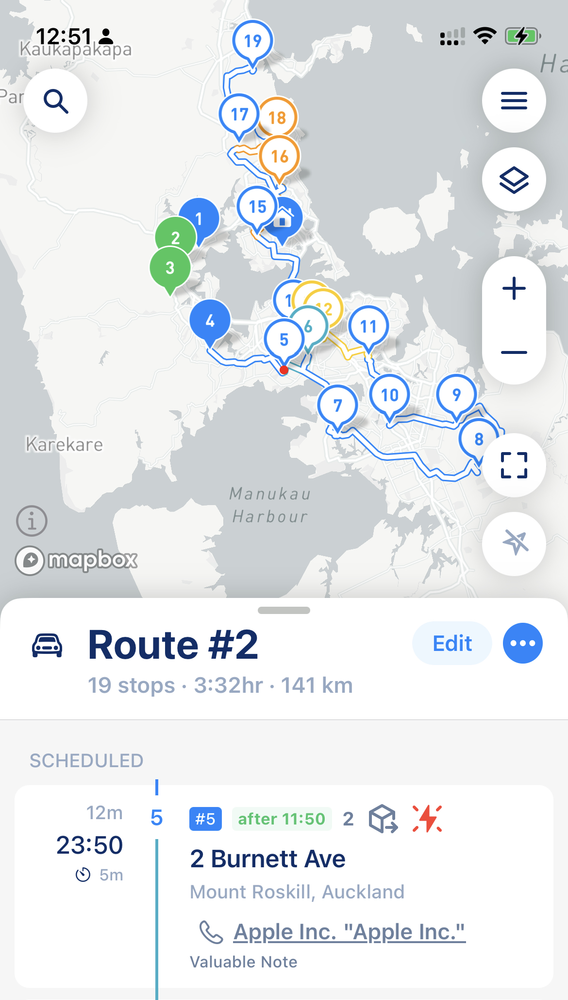

# Understanding Stop Settings

To make sure your route matches your visit/delivery instructions or real-world situations, MyWay has a couple of options you can set up for any stop:

* Priority
* Time Window
* Service Time (Stop Duration)

Also, there are some other settings that can help you to classify each stop in your list, like:

* Tracking ID
* Shipment Type
* Color
* Notes
* Tags
* Contact Details

<figure><figcaption>
Stop's Settings - Page 1
</figcaption></figure>

 

<figure><figcaption>
Stop's Settings - Page 2
</figcaption></figure>

When the last set of stop settings is visual and does not affect the route optimization algorithm, the **first set of settings does affect optimization algorithms and can dramatically change the stop sequence**. To access those settings, simply tap on the stop you added to the route to see a list of stop settings and parameters.

Some of those stop settings, like Shipment type, Tracking ID, Notes, Contact Details, etc., will be shown on the stop card on the main screen. You also can do some operations with it (like call your customer's phone number or send a message) directly from the stop card. See screenshot below

<figure><figcaption>
Stop Card on Route Main Screen that shows stop settings
</figcaption></figure>

## Stop Settings

### Priority (ASAP button)

Does affect urgency and stop prioritization. If you need one or two stops to be visited ASAP, use that setting to tell MyWay must be prioritized.&#x20;


Please make sure you don't set priority for more than 2 stops. When every stop is a priority, there are no priorities at all.


### Time Windows 

* Arrive between Now and Anytime: The default setting. MyWay will place the stop in the route wherever it's more efficient.
* Arrive between 10 AM and Anytime: In this example, MyWay will make sure you'll arrive at the stop any time _after_ 10 AM.
* Arrive between Now and 10 AM: In this example, MyWay will make sure you'll arrive at the stop any time _before_ 10 AM.

Use Time Windows when you need to be at a stop before, after, or between specific times. **It's not recommended to have time windows for all stops or have them narrowed down to 1-2 hours (the best practice is considered between 3-5 hours)**

Time Windows might behave differently when you plan a multi-day route. To understand the difference, please [check this article](planning-multi-day-routes.md#time-windows).


Please keep in mind that in some cases, when you have a time window for the majority of stops, it is simply impossible to satisfy every time window constraint. In this case, MyWay will ignore some time windows and build you the most efficient route possible based on that ignorance. MyWay will notify you which stops are outside of the time windows so you can prioritize them manually.

Also, time windows are going to be ignored entirely if you choose route optimization for distance. The only mode that supports time windows is "optimization by time." Also, time windows will be ignored if you decide to follow your route in your (current) order. To learn more about Optimisation Settings and options, check [this article](understand-optimisation-settings.md).


### Service Time (Stop Duration)

To calculate accurate ETAs, MyWay needs to know how much time you'll spend at each stop. This is the amount of time between stopping your car for the visit/delivery and leaving again for the next stop.

If you know a specific stop will take more or less time, you can use this option to add the correct duration. Each stop can have its own stop duration. **Try setting up stop duration as accurately as possible. If it's off by even 1 or 2 minutes, it can greatly impact your ETAs.** Please check [our article on suggested stop durations](../faq/what-service-time-should-you-choose.md).
